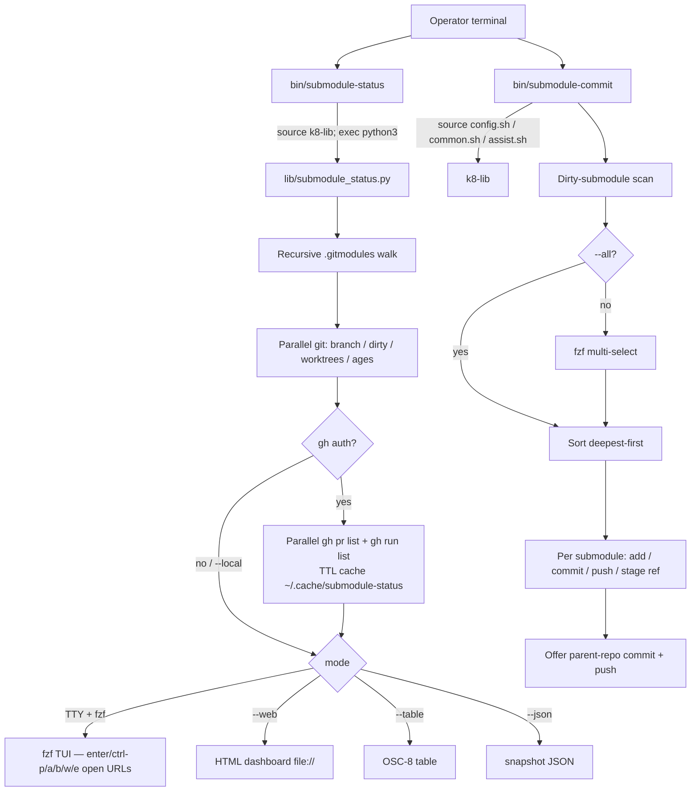

# Project Architecture — github-utils

## Overview

`github-utils` is a terminal utility package providing interactive
git-submodule workflow tooling:

- **`submodule-status`** — read-only dashboard: recursive `.gitmodules` walk,
  worktrees with ages, open GitHub PRs + branch names, Actions run status.
  Presentation: fzf TUI (OSC-8 + key/mouse open), HTML dashboard (`--web`),
  stdout table, or JSON.
- **`submodule-commit`** — bulk commit/push across dirty submodules with
  deepest-first nested-ref bubbling.

Both auto-detect the git root (`git rev-parse --show-toplevel`) and work in
any repository with `.gitmodules`. They layer on the shared `k8-lib` shell
library for `--config` / `--assist` / logging helpers. `submodule-status`
additionally requires Python 3 (stdlib only) and optionally `gh`.

## System Diagram

## Core Components

| Component | Purpose |
|-----------|---------|
| `bin/submodule-status` | Bash wrapper: k8-lib assist, locate Python module, reload loop (exit 42) |
| `lib/submodule_status.py` | Collector + fzf/HTML/table/JSON renderer (Python 3 stdlib, `git`/`gh`/`fzf` subprocesses) |
| `bin/submodule-commit` | Bash tool: scan, select, deepest-first commit/push, parent-ref staging |
| `Makefile` | `make install` copies `bin/submodule-*` to `~/.local/bin` and the Python module to `~/.local/share/github-utils/`; `make test` runs `bash -n` + unit tests |
| `k8-lib` (external) | Shared shell library: `config.sh`, `common.sh` (`step`/`ok`/`warn`/`die`), `assist.sh` |
| `README.md` | Install, prerequisites, usage |

## Execution Flow — submodule-status

1. **Bootstrap** — wrapper pre-parses `--config`, sources k8-lib, handles `--assist`, execs Python.
2. **Scan** — recursive `.gitmodules` walk (nested modules included); optional path prefix filter.
3. **Local enrich** — parallel `git` per checkout: branch, SHA, dirty counts, `worktree list --porcelain`, ages (HEAD `%ct` / dir mtime), optional local branches.
4. **GitHub enrich** — unique `owner/repo` from origin / `.gitmodules` URL; parallel `gh pr list` + `gh run list`; TTL cache. Missing `gh` or auth degrades to local-only with a warning (does not abort).
5. **Render** — TUI / HTML / table / JSON. TUI keys and HTML clicks open `https://github.com/...` (repo, pulls, actions, tree, PR) or `file://` for worktrees.

## Execution Flow — submodule-commit

1. **Bootstrap** — same k8-lib pattern as other Noizu shell utilities.
2. **Scan** — `walk_submodules` recurses `.gitmodules`; `check_dirty` counts staged/modified/untracked.
3. **Select** — `fzf --multi` or `--all`.
4. **Order & execute** — `sort_deepest_first`; per submodule add/commit/push then stage ref in parent.
5. **Parent handoff** — offer to commit + push the root repo.

## Key Decisions

- **Two tools, one package**: status is read-only and GitHub-aware; commit is write-path and git-only. Makefile glob `bin/submodule-*` installs both.
- **Python collector**: ~70 remotes need concurrent `gh`/`git`; stdlib `ThreadPoolExecutor` beats a giant bash loop without adding pip deps.
- **`gh` is optional**: a worktree dashboard is still useful offline / without auth. PRs and Actions require `gh auth login`. No tokens stored.
- **Click paths**: HTML dashboard is the real mouse UI; fzf uses `open`/`xdg-open` on enter/double-click plus OSC-8 in the preview for terminals that support it.
- **Deepest-first commit ordering**: nested submodule refs must commit before parents stage them.
- **Repo-agnostic**: git root from cwd; not hard-coded to the Noizu monorepo.
- **Cache is GitHub-only**: `~/.cache/submodule-status/` holds `gh` JSON, last snapshot, and `dashboard.html`. Git operations always live.

## Ecosystem Fit

Installed via this package's `make compile` / `make install`, or repo-root
`make install-utilities` (`utilities/shell/github-utils` SUBDIRS fan-out).
Binaries land on `$PATH` at `~/.local/bin`; the Python collector at
`~/.local/share/github-utils/`. Layout: [PROJ-LAYOUT.md](PROJ-LAYOUT.md).
