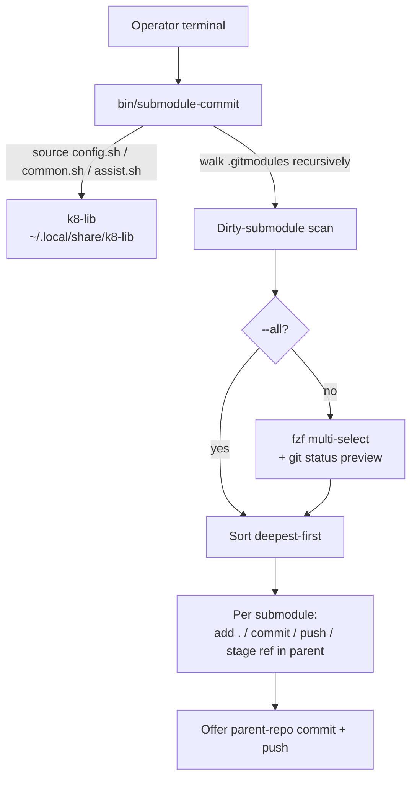

# Project Architecture — github-utils

## Overview

`github-utils` is a small terminal utility package in the Noizu Infra monorepo
(`utilities/shell/github-utils/`) providing interactive git-submodule workflow
tooling. Its single tool today, `submodule-commit`, performs bulk
commit/push across dirty submodules — recursively discovering nested
submodules, letting the operator multi-select via `fzf`, then committing
deepest-first so that nested submodule refs "bubble up" correctly through
parent repos before finally offering to commit the root repo.

Architecturally it is a self-contained Bash script layered on the shared
`k8-lib` shell library that all Noizu utilities use for config resolution,
logging helpers, and assist-mode support. The tool is stateless: it derives
everything from the git repository it is run inside (`git rev-parse
--show-toplevel` + `.gitmodules` walking) and touches no files of its own.

## System Diagram

## Core Components

| Component | Purpose |
|-----------|---------|
| `bin/submodule-commit` | ~290-line Bash tool: scan, select, deepest-first commit/push, parent-ref staging |
| `Makefile` | `make install` copies `bin/submodule-*` to `$INSTALL_DIR` (default `~/.local/bin`); `compile`/`test` are no-ops |
| `k8-lib` (external, `share/k8-lib/`) | Shared shell library sourced at runtime: `config.sh` (yaml config + `--config` flag), `common.sh` (`step`/`ok`/`warn`/`die`, colors), `assist.sh` (help/assist hook) |
| `README.md` | Install, prerequisites (`git`, `fzf`), usage flags, nested-submodule workflow |

## Execution Flow

1. **Bootstrap** — pre-parse `--config` before sourcing k8-lib (config must resolve first), then source `config.sh`, `common.sh`, `assist.sh` from `K8_LIB_DIR`.
2. **Scan** — `walk_submodules` recurses `.gitmodules` at every nesting level; `check_dirty` counts staged/modified/untracked files per submodule.
3. **Select** — `fzf --multi` with a `git status --short` preview pane, or `--all` to skip.
4. **Order & execute** — `sort_deepest_first` (path-depth sort) guarantees a nested submodule commits before its parent, so each parent stages the fresh ref (`git add <submodule>`) as part of the same pass.
5. **Parent handoff** — if refs were staged in the root repo, interactively offer to commit and push it too. Push failures warn but do not abort the batch.

## Key Decisions

- **Deepest-first ordering**: nested submodules (submodule-in-submodule) must commit before their parents or the parent's staged ref would point at a stale SHA. A path-depth sort is the whole ordering mechanism — simple and sufficient.
- **k8-lib dependency, not vendored**: shares config (`k8-util-config.yaml` / `infra-config.yaml` via `--config`), logging style, and assist behavior with the rest of the `utilities/` fleet; `K8_LIB_DIR` env var overrides the default location.
- **Repo-agnostic**: git root auto-detected from cwd; works in any repo with `.gitmodules`, not just the Noizu monorepo (which itself uses subtrees, not submodules — this tool serves *other* repos and nested checkouts).
- **Safety modes**: `--dry-run` prints the full planned command sequence; `--no-push` keeps everything local; `-m` + `--all` enable fully non-interactive use.
- **Fail-soft pushes**: a failed `git push` (missing remote, auth) warns and continues rather than aborting the remaining submodules.

## Ecosystem Fit

Part of the Noizu `utilities/` collection: installed alongside all other
DevOps tools by the repo-root `make install-utilities` (or standalone via this
package's `make install`), placed on `$PATH` at `~/.local/bin`. The Makefile's
`bin/submodule-*` glob means new tools dropped in `bin/` with that prefix are
picked up automatically. Layout details: [PROJ-LAYOUT.md](PROJ-LAYOUT.md).
