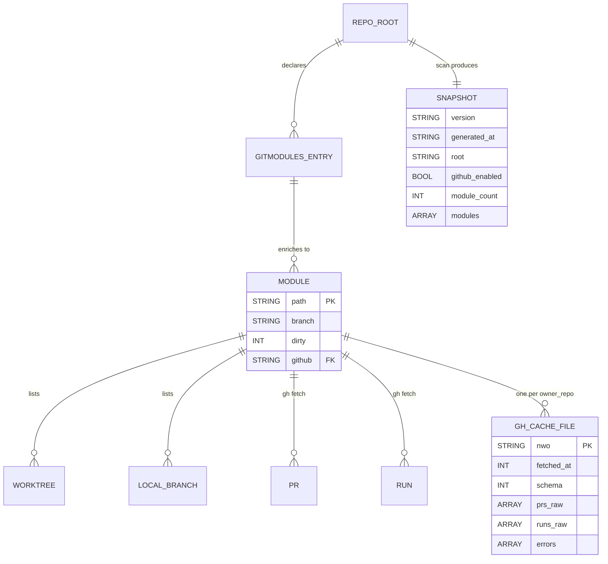

# Project Schema — Data & Config Artifacts

> **No persistence layer.** github-utils is a CLI tool package (bash + Python).
> It has **no database, no SQL schema, and no server-side state**. All durable
> artifacts are: the git-native `.gitmodules` input format, a per-user runtime
> cache/snapshot directory, and shell configuration via env vars / k8-lib config.
> This document covers those instead of table schemas.
>
> Code organization: see [PROJ-LAYOUT.md](PROJ-LAYOUT.md) (`bin/submodule-status`
> wrapper, `lib/submodule_status.py` collector, runtime cache under `~/.cache/submodule-status/`).

## Overview

| Artifact | Kind | Location | Lifetime |
|----------|------|----------|----------|
| `.gitmodules` | Input format (git-native) | Repo root of any scanned repo | Per repo, version-controlled |
| `gh/<owner>__<repo>.json` | GitHub response cache | `~/.cache/submodule-status/` (XDG-aware) | TTL 90 s (default), `--refresh` bypasses |
| `snapshot.json` | Collected scan snapshot | `~/.cache/submodule-status/` | Overwritten per run |
| `dashboard.html` | Rendered HTML dashboard | `~/.cache/submodule-status/` | Overwritten per `--web` run |
| k8-lib config | Shared shell config | `K8_CONFIG` path via `--config` | Consumed by k8-lib, not by the Python |

## Cache directory

`cache_dir()` resolves to `$XDG_CACHE_HOME/submodule-status` or
`~/.cache/submodule-status/`. Created on demand. **Contains no credentials** —
only raw `gh pr list` / `gh run list` JSON output and derived scan data; GitHub
auth lives entirely in the `gh` CLI's own config.

## `gh/<owner>__<repo>.json` — per-repo GitHub cache

One file per `owner/repo` (slash → `__`, spaces → `_`). Written atomically
(temp file + rename). `schema` is a format version (`CACHE_SCHEMA = 1`).

| Field | Type | Description |
|-------|------|-------------|
| `nwo` | string | `owner/repo` key |
| `fetched_at` | int | Unix epoch seconds of fetch (TTL check) |
| `schema` | int | Cache format version, currently `1` |
| `prs_raw` | array | Raw `gh pr list --json` records (≤ 30 open PRs) |
| `runs_raw` | array | Raw `gh run list --json` records (≤ 8 recent runs) |
| `errors` | array | Per-call error strings from the `gh` invocations |

## `snapshot.json` / `--json` — snapshot format

Written by `write_snapshot()` (default `snapshot.json`, or `--dump <path>`) and
printed by `--json`. Also the IPC payload between the bash wrapper and the
Python collector (`--snapshot` / `SUBMODULE_STATUS_SNAP`).

| Field | Type | Description |
|-------|------|-------------|
| `version` | string | Tool version |
| `generated_at` | string | ISO-8601 UTC timestamp |
| `root` | string | Absolute scanned repo root |
| `github_enabled` | bool | Whether `gh` was usable |
| `github_note` | string | Human note when GitHub was skipped |
| `module_count` / `pr_count` / `failing_count` / `dirty_count` / `worktree_count` / `local_only_count` / `merged_local_count` | int | Rollups |
| `modules` | array | Module records (below), root first |

### `modules[]` record

| Field | Type | Description |
|-------|------|-------------|
| `path` / `abs_path` / `name` | string | Submodule location and display name |
| `gitmodules_url` / `configured_branch` | string | From `.gitmodules` |
| `missing` | bool | Not checked out |
| `staged` / `modified` / `untracked` / `dirty` | int/bool | Working-tree state |
| `branch` / `head` / `head_short` / `detached` | — | HEAD state |
| `worktrees[]` / `wt_count` / `extra_worktrees` | — | `git worktree list --porcelain` parse (with ages) |
| `branches[]` / `local_only[]` / `lo_count` / `merged_into` | — | Local branch inventory, unmerged-branch flags |
| `github` (`owner/repo`) / `repo_url` / `prs_url` / `actions_url` / `branch_url` | string/null | Derived GitHub URLs |
| `prs[]` / `runs[]` / `ci` / `pr_count` | — | Normalized PR + Actions records, CI rollup `{label, state}` |
| `search` | string | Lowercased haystack for fzf filtering |

## ERD — artifact relationships



```plantuml
@startuml
skinparam linetype ortho

TABLE(REPO_ROOT) {
  * path : VARCHAR
}
TABLE(GITMODULES_ENTRY) {
  * name : VARCHAR <<PK>>
  --
  path : VARCHAR
  url : VARCHAR
  branch : VARCHAR
}
TABLE(SNAPSHOT) {
  * generated_at : TIMESTAMP <<PK>>
  --
  version : VARCHAR
  root : VARCHAR
  github_enabled : BOOL
  modules : JSON_ARRAY
}
TABLE(MODULE) {
  * path : VARCHAR <<PK>>
  --
  branch : VARCHAR
  head : VARCHAR
  dirty : BOOL
}
TABLE(GH_CACHE_FILE) {
  * nwo : VARCHAR <<PK>>
  --
  fetched_at : INT
  schema : INT
  prs_raw : JSON_ARRAY
  runs_raw : JSON_ARRAY
}

REPO_ROOT ||--o{ GITMODULES_ENTRY : declares
REPO_ROOT ||--|| SNAPSHOT : "scan produces"
GITMODULES_ENTRY ||--o{ MODULE : enriches
MODULE ||--o{ GH_CACHE_FILE : "caches gh output"
@enduml
```

## Configuration

### Env vars

| Var | Consumer | Purpose |
|-----|----------|---------|
| `XDG_CACHE_HOME` | Python | Cache base dir (default `~/.cache`) |
| `K8_LIB_DIR` | bash wrappers | k8-lib location (default `~/.local/share/k8-lib`) |
| `K8_CONFIG` | k8-lib (set by `--config`) | Path to `k8-util-config.yaml` / `infra-config.yaml` |
| `GITHUB_UTILS_SHARE` / `GITHUB_UTILS_LIB_DIR` | bash wrappers | Python module dir (default `~/.local/share/github-utils`) |
| `SUBMODULE_STATUS_PY` | Python | Override collector script path (wrapper re-invocation) |
| `SUBMODULE_STATUS_SNAP` | Python | Snapshot path for preview/action re-invocations |
| `NO_COLOR` / `FORCE_COLOR` | Python | Disable/force ANSI color |
| `SUBMODULE_STATUS_NO_LINKS` | Python | Disable OSC-8 hyperlinks |
| `TERM` | Python | `""`/`dumb` disables links + color |

### Config files

- **`--config <path>`** is pre-parsed by the bash wrappers into `K8_CONFIG` and
  consumed by the shared **k8-lib** (`config.sh`). The Python collector accepts
  the flag for compatibility but does not read the file itself — the tools work
  with zero configuration.
- No tokens/keys are defined or stored by this package; `gh` handles its own auth.

## Notes

- `.gitmodules` parsing reads `submodule.<name>.path|url|branch` via
  `git config -f`; nested `.gitmodules` files are walked recursively.
- Cache misses/expiry are transparent: stale (> TTL) or corrupt JSON is refetched.
