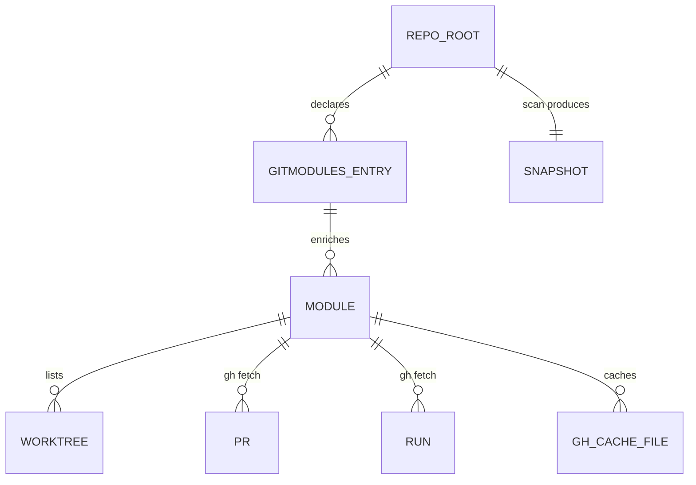

# Project Schema — Summary

> **No persistence layer** — CLI tool package, no DB/SQL. Artifacts = git input
> format + per-user cache dir + env/config. Full detail: [PROJ-SCHEMA.md](PROJ-SCHEMA.md)

## Artifacts

| Artifact | Location | Format |
|----------|----------|--------|
| `.gitmodules` | scanned repo root | `submodule.<name>.path/url/branch` (git config) |
| `gh/<owner>__<repo>.json` | `~/.cache/submodule-status/` (XDG-aware) | `{nwo, fetched_at, schema:1, prs_raw[], runs_raw[], errors[]}` — TTL 90 s |
| `snapshot.json` | `~/.cache/submodule-status/` (or `--dump`) | `{version, generated_at, root, github_enabled, github_note, 7 rollup counts, modules[]}` — also `--json` stdout |
| `dashboard.html` | `~/.cache/submodule-status/` | Rendered HTML (`--web`) |

`modules[]`: path/branch/head/dirty counts + worktrees[], branches[], local_only[],
prs[], runs[], ci {label,state}, derived GitHub URLs. No credentials stored —
`gh` owns auth.

## Config surface

`--config` → `K8_CONFIG` (k8-lib only; Python flag unused) · `K8_LIB_DIR` ·
`GITHUB_UTILS_SHARE`/`_LIB_DIR` · `SUBMODULE_STATUS_PY` · `SUBMODULE_STATUS_SNAP` ·
`XDG_CACHE_HOME` · `NO_COLOR`/`FORCE_COLOR`/`SUBMODULE_STATUS_NO_LINKS`/`TERM`.
Zero-config by default.
